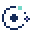

<picture>
  <source media="(prefers-color-scheme: dark)" srcset=".github/assets/icon-dark.svg">
  
</picture>

# Lagrange

Lagrange는 촘촘하고 정확한 data interface를 위한 editorial React design system입니다.

- Package: <code>@fleetia/lagrange</code>
- Registry: GitHub Packages
- Runtime: React 18.2 이상, React 19 지원
- Toolchain: Node.js 22.14 이상, pnpm 11.9.0
- License: AGPL-3.0-only

현재 API는 <code>1.0.0</code> 이전 단계입니다. 공개 API와 visual language가 안정화되기 전까지 minor release에서도 migration이 필요할 수 있습니다.

## Figma

디자인 원본은 [Lagrange — Library & Playground](https://www.figma.com/design/vKl8h9uoXUUljJ5yEAcNpr)에서 확인할 수 있습니다.

## 설치

GitHub Packages는 package를 읽을 때도 GitHub token을 요구합니다. consumer repository에는 registry mapping만 저장합니다.

```ini
@fleetia:registry=https://npm.pkg.github.com
always-auth=true
```

pnpm 11은 committed project configuration의 registry credential을 신뢰하지 않으므로 token은 user-level configuration에만 설정합니다. GitHub의 <code>personal access token (classic)</code>을 사용하고, 설치 token에는 최소 <code>read:packages</code> 권한만 부여하세요.

```bash
export NODE_AUTH_TOKEN="YOUR_GITHUB_PACKAGES_TOKEN"
pnpm config set --location=user //npm.pkg.github.com/:_authToken "$NODE_AUTH_TOKEN"
```

CI에서는 <code>actions/setup-node</code>의 <code>registry-url</code>과 secret <code>NODE_AUTH_TOKEN</code>을 사용합니다.

```bash
pnpm add @fleetia/lagrange
```

실제 token, <code>.env</code>, user-level <code>~/.npmrc</code>를 repository에 commit하지 마세요. token이 노출되면 즉시 revoke하고 새 token으로 교체해야 합니다.

## 사용

application entry에서 global stylesheet를 한 번 불러오고, UI root를 <code>ThemeRoot</code>로 감쌉니다.

```tsx
import type { ReactElement } from 'react';
import { ThemeRoot } from '@fleetia/lagrange';
import '@fleetia/lagrange/styles.css';

import { App } from './App';

export function Root(): ReactElement {
  return (
    <ThemeRoot>
      <App />
    </ThemeRoot>
  );
}
```

<code>styles.css</code>는 theme와 component styles를 포함합니다. application의 reset은 consumer가 소유하며, Lagrange stylesheet는 entry에서 한 번만 import합니다.

### Theme customization

Lagrange theme은 raw value인 <code>primitiveTokens</code>, UI 역할을 표현하는 <code>semanticTokens</code>, 특정 component의 결정을 분리하는 <code>componentTokens</code>의 세 계층으로 구성됩니다. component stylesheet는 primitive color 이름에 직접 의존하지 않습니다.

전체 brand theme은 consumer의 Vanilla Extract build에서 미리 compile하고 <code>themeClassName</code>으로 기본 theme을 교체합니다.

```bash
pnpm add -D @vanilla-extract/css @vanilla-extract/vite-plugin
```

Consumer bundler에도 Vanilla Extract integration을 등록해야 합니다. 아래는 theme 작성 API이며, Vite 설정을 포함한 전체 예시는 [Theming guide](./docs/theming.md)를 참고하세요.

```ts
import { createTheme } from '@vanilla-extract/css';
import { createThemeTokens, themeVars } from '@fleetia/lagrange/theme';

export const brandThemeClass = createTheme(
  themeVars,
  createThemeTokens({
    semantic: {
      color: {
        content: { accent: '#294f59' },
        interaction: {
          primary: '#294f59',
          primaryHover: '#7a5736',
        },
      },
    },
  }),
);
```

```tsx
<ThemeRoot themeClassName={brandThemeClass}>
  <App />
</ThemeRoot>
```

작은 brand 조정은 stable CSS variable을 application stylesheet에서 override하고 기존 default theme을 유지할 수 있습니다.

```css
.brand-surface {
  --lagrange-semantic-color-content-accent: #294f59;
  --lagrange-semantic-color-interaction-primary: #294f59;
}
```

```tsx
<ThemeRoot className="brand-surface">
  <App />
</ThemeRoot>
```

두 방식의 contract와 token 선택 기준은 [Theming guide](./docs/theming.md)에 정리되어 있습니다. 기존 <code>tokens</code>, <code>vars</code>, <code>themeClass</code> export는 호환성을 위해 유지됩니다.

<code>FormField</code>는 direct form control 하나를 받습니다. field 안에서는 <code>id</code>와 <code>required</code>를 <code>FormField</code>에 지정하고, child의 같은 prop은 standalone 사용에만 적용됩니다. 현재 <code>TextField</code>, <code>TextArea</code>, <code>NumberField</code>, <code>DateField</code>, <code>Select</code>, <code>Combobox</code>, <code>RangeField</code>, <code>ColorField</code>가 이 contract를 지원합니다.

## Components

Lagrange는 app domain을 포함하지 않는 generic component만 제공합니다.

| Family     | Components                                                                                                                                                                                                                                                                                             |
| ---------- | ------------------------------------------------------------------------------------------------------------------------------------------------------------------------------------------------------------------------------------------------------------------------------------------------------ |
| Foundation | <code>ThemeRoot</code>, <code>Text</code>, <code>Heading</code>, <code>Rule</code>, <code>Stack</code>, <code>Inline</code>, <code>VisuallyHidden</code>                                                                                                                                               |
| Structure  | <code>Section</code>, <code>SectionHeader</code>, <code>Toolbar</code>, <code>FieldGroup</code>, <code>FieldGrid</code>, <code>Breadcrumb</code>, <code>Tabs</code>, <code>TabList</code>, <code>Tab</code>, <code>TabPanel</code>                                                                     |
| Command    | <code>Action</code>, <code>Button</code>, <code>Icon</code>, <code>IconButton</code>, <code>IconTile</code>                                                                                                                                                                                            |
| Input      | <code>FormField</code>, <code>TextField</code>, <code>TextArea</code>, <code>NumberField</code>, <code>DateField</code>, <code>Select</code>, <code>Combobox</code>, <code>RangeField</code>, <code>ColorField</code>, <code>ColorPicker</code>, <code>PlacementPicker</code>, <code>InlineEdit</code> |
| Choice     | <code>Checkbox</code>, <code>RadioGroup</code>, <code>Radio</code>, <code>Switch</code>, <code>ChoiceGroup</code>, <code>Choice</code>                                                                                                                                                                 |
| Overlay    | <code>Dialog</code>, <code>ContextMenu</code>, <code>ContextMenuItem</code>                                                                                                                                                                                                                            |
| Feedback   | <code>SaveStatus</code>, <code>StatusMarker</code>                                                                                                                                                                                                                                                     |
| Data       | <code>Metric</code>, <code>DataTable</code>, <code>DataGrid</code>, <code>RadialBreakdownChart</code>                                                                                                                                                                                                  |

<code>DataTable</code>은 semantic read-only data에 사용합니다. keyboard cell navigation, sorting, row selection, inline editing이 필요하면 <code>DataGrid</code>를 사용합니다. <code>RadialBreakdownChart</code>에는 자산·부채 같은 domain 의미를 넣지 않고 segment와 formatter만 전달합니다.

Storybook은 각 component의 Default, Variants, States, Accessibility와 실제 keyboard interaction을 제공합니다.

### Icon tiles

<code>IconTile</code>은 아이콘과 이름으로 구성된 native button입니다. 기본 크기는 80×80px이며, <code>style</code>이나 <code>className</code>으로 크기와 색을 조정합니다. 아이콘과 이름 사이 간격은 <code>semantic.space.sm</code>(기본 8px)을 사용합니다.

Figma의 compact 80×80px 기준은 [02 Library의 IconTile main component](https://www.figma.com/design/vKl8h9uoXUUljJ5yEAcNpr?node-id=232-5469)와 [Starlit Playground instance](https://www.figma.com/design/vKl8h9uoXUUljJ5yEAcNpr?node-id=232-5470)에 반영되어 있습니다. main component는 세로 Auto Layout에 <code>semantic/space/sm</code> 간격, 세로 3px·가로 8px padding, <code>Text/Caption/Medium</code> style을 사용합니다. fill과 1px stroke는 각각 <code>semantic/color/surface/raised</code>, <code>semantic/color/border/subtle</code>에 연결되어 있습니다. 62×28.6px label viewport는 auto-height text를 clip하고 Prototype의 vertical scrolling을 제공합니다.

[300px 높이 예시](https://www.figma.com/design/vKl8h9uoXUUljJ5yEAcNpr?node-id=232-11177)는 같은 token과 text style을 사용하는 독립 Auto Layout frame입니다. 고정 크기인 compact instance와 달리 label viewport를 84px로 설정해 긴 이름 전체가 들어가는 상태를 보여줍니다. 코드에서는 카드 높이와 이름 길이에 따라 viewport 높이를 계산합니다.

```tsx
import { IconTile } from '@fleetia/lagrange';

<IconTile
  icon={<span>★</span>}
  label="여러 줄로 표시하고 끝까지 읽을 수 있는 긴 이름"
  style={{ height: 300 }}
/>;
```

| Prop                    | Type                        | 기본값과 의미                                                                                                         |
| ----------------------- | --------------------------- | --------------------------------------------------------------------------------------------------------------------- |
| <code>icon</code>       | <code>ReactNode</code>      | 필수. 장식용 아이콘을 전달합니다.                                                                                     |
| <code>label</code>      | <code>string</code>         | 필수. 표시할 이름이며 button의 기본 accessible name입니다.                                                            |
| <code>iconSize</code>   | <code>number</code>         | 28. 아이콘 영역의 px 크기이며 이름에 남는 높이를 계산합니다.                                                          |
| <code>layout</code>     | <code>IconTileLayout</code> | <code>'vertical'</code>. 세로 배치는 줄바꿈하고 가로 배치는 한 줄 ellipsis를 사용합니다.                              |
| <code>labelProps</code> | <code>span</code> props     | 이름 영역에 class, style, data attribute 등을 전달합니다. <code>children</code>과 <code>tabIndex</code>는 제외합니다. |

<code>children</code>을 제외한 native button props와 <code>ref</code>를 지원합니다. 세로 이름이 길면 완전한 줄이 들어가는 높이로 viewport를 제한하고 내부에서 스크롤합니다. button에 focus한 상태에서 ArrowUp/ArrowDown은 한 줄, PageUp/PageDown은 viewport 높이만큼 이동하고 Home/End는 처음과 끝으로 이동합니다. Enter/Space는 button을 활성화합니다. 이름 영역은 wheel과 touch로도 스크롤할 수 있습니다. 브라우저가 스크롤 가능한 이름 영역에 별도 focus를 제공하면 그 영역에서는 native keyboard scrolling을 사용합니다.

이름이 넘칠 때만 스크롤 키의 기본 동작을 막습니다. 가로 배치와 Alt/Ctrl/Meta 조합은 소비하지 않으며, consumer의 <code>onKeyDown</code>이 먼저 실행되어 <code>preventDefault()</code>로 내부 스크롤을 막을 수 있습니다. 이름 전체는 스크롤 위치와 관계없이 accessible name에 포함됩니다. 별도 이름이 필요하면 <code>aria-label</code>을 전달합니다.

DOM slots는 <code>data-lagrange-part="icon-tile"</code>, <code>"icon-tile-icon"</code>, <code>"icon-tile-label"</code>로 구분합니다. 실행 예시는 [IconTile 소스와 stories](./src/components/IconTile)를 참고하세요.

button focus에서의 여섯 스크롤 키와 Enter/Space 활성화는 [browser tests](./tests/icon-tile.spec.ts)로 Chromium·WebKit에서 확인합니다. axe는 label의 parent button key handler를 추론하지 못하므로, [overflow accessibility test](./tests/storybook.a11y.spec.ts)는 해당 label 하나의 <code>scrollable-region-focusable</code> 결과만 실제 키보드 검증으로 확인합니다. 다른 axe rule과 다른 target의 위반은 허용하지 않습니다.

### Color controls

<code>ColorField</code>는 화면 안에서 CSS color를 입력하거나 native picker를 여는 control입니다. <code>ColorPicker</code>는 작은 swatch 버튼에서 Dialog를 열어 hue wheel, saturation/lightness와 HEX/RGBA/HSLA channel 입력을 조합합니다. Coarse pointer 환경에서는 wheel과 saturation/lightness slider를 숨기고 native picker와 입력을 사용합니다.

<code>ColorPicker</code>는 필수 <code>label</code>과 controlled <code>value</code>를 받고, 변경값을 <code>onValueChange</code>로 전달합니다. 출력은 기본적으로 hex이며 <code>showAlpha</code>를 켜면 hex8입니다. format 선택은 편집 방식만 바꾸며 callback의 출력 형식을 바꾸지 않습니다. 변경은 각 control에서 반영되므로 Dialog를 닫는 것이 이미 반영한 색을 되돌리지는 않습니다.

화면 label과 오류 안내는 <code>FormField</code>로 조합할 수 있습니다. <code>ColorPicker</code>의 <code>label</code>은 trigger와 Dialog 이름에도 쓰이므로 함께 전달합니다. 팀별 배색이나 색의 업무 의미는 consumer가 소유합니다. 상세 props와 실행 예시는 [ColorPicker 소스와 stories](./src/components/ColorPicker)를 참고하세요.

## Design principles

Lagrange는 generic SaaS dashboard보다 편집물과 technical ledger에 가까운 화면을 지향합니다.

- 정보 밀도를 우선하고 불필요한 card, pill, shadow, 큰 radius를 피합니다.
- typography와 spacing으로 계층을 만들고 box는 의미 있는 경계에만 사용합니다.
- focus와 error에서 border 두께나 component 크기를 바꾸지 않습니다. color, marker, background wash로 상태를 표현해 layout shift를 막습니다.
- table과 반복 목록은 compact rhythm을 유지합니다. 기본 row는 22–24px 범위를 목표로 합니다.
- decorative effect보다 읽기 순서, 숫자 정렬, keyboard interaction, contrast를 우선합니다.

### Rule semantics

Rule은 단순한 장식이 아니라 정보 구조를 표현합니다.

| Semantic                | 표현                       | 사용처                                                                                    |
| ----------------------- | -------------------------- | ----------------------------------------------------------------------------------------- |
| <code>weak</code>       | dotted hairline            | body row, 같은 group 내부의 약한 구분                                                     |
| <code>boundary</code>   | single 1px rule            | 일반 section 경계, editable field baseline                                                |
| <code>structural</code> | 1px rule 두 개와 2–3px gap | <code>thead</code>/<code>tbody</code>, subtotal/total, form/action처럼 구조가 바뀌는 경계 |

<code>structural</code>을 두꺼운 2px border 한 줄로 대체하지 않습니다. double rule의 두 선과 사이 공간이 구조적 의미의 일부입니다.

## 개발

```bash
corepack enable
corepack install --global pnpm@11.9.0
pnpm install
pnpm dev
```

주요 command:

| Command                           | 역할                                                                                    |
| --------------------------------- | --------------------------------------------------------------------------------------- |
| <code>pnpm lint</code>            | Oxlint                                                                                  |
| <code>pnpm lint:fix</code>        | Oxlint 자동 수정                                                                        |
| <code>pnpm format</code>          | Oxfmt 자동 포맷팅                                                                       |
| <code>pnpm format:check</code>    | Oxfmt 포맷 검증                                                                         |
| <code>pnpm typecheck</code>       | TypeScript type check                                                                   |
| <code>pnpm test</code>            | Vitest unit tests                                                                       |
| <code>pnpm build</code>           | package build와 type declarations 생성                                                  |
| <code>pnpm verify:react-18</code> | packed package의 React 18.2 type compatibility 검증                                     |
| <code>pnpm storybook:build</code> | static Storybook build                                                                  |
| <code>pnpm test:visual</code>     | Playwright accessibility와 visual checks                                                |
| <code>pnpm check</code>           | lint, format, typecheck, unit, React 18 compatibility, package/consumer/Storybook build |

Playwright를 처음 실행하는 machine에서는 browser를 설치합니다.

```bash
pnpm exec playwright install chromium
pnpm test:visual
```

자세한 contribution 규칙은 [CONTRIBUTING.md](./CONTRIBUTING.md)를 참고하세요.

## Release

Lagrange는 Changesets로 version을 관리하고 GitHub Packages에만 배포합니다.

1. publishable change와 함께 <code>pnpm changeset</code>을 실행합니다.
2. <code>main</code>에 merge되면 Release workflow가 release PR을 생성하거나 갱신합니다.
3. release PR을 merge하면 workflow가 build 후 <code>@fleetia/lagrange</code>를 publish합니다.
4. workflow는 repository-scoped <code>GITHUB_TOKEN</code>과 <code>packages: write</code>만 사용합니다.

개인 token으로 local publish하지 않고 version을 수동으로 수정하지 않습니다.

## License

[AGPL-3.0-only](./LICENSE)
